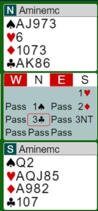

# Contoh-contoh 1H

1NT = 12-15 HCP 5+H  

## Table of Contents

- [Part Score](#part-score)
    [1H-1NT](#part-score-1h-1nt)
- [Invite](#invite)
- [Game](#Game)
    - [1H-1S](#game-1h-1s)
    - [1H-2C](#game-1h-2c)
    - [1H-4H](#game-1h-4h)
- [Slam Interest](#slam-interest)

## Part Score

## Part Score: 1H-1NT

1NT disini tujuannya adalah dipass atau jika dibid apapun balik 2D / 2H.

- Jika dipass
    - yaudah main 1NT, kalau musuh masuk, bid Diamond
- Jika dibid 2C
    - bid 2D T/P
- Jika dibid 2D
    - bakal pass main 2D
- Jika dibid 2H
    - bakal pass main 2H
- Jika dibid 2S
    - bakal pass main 2S

## Invite

## Game

## Game: 1H-1S
Banyak sekali tujuan dari bidding 1S, tetapi untuk game biasanya :

- Cari 6 lembar H opener
- Cari fit S 5-3 / 4-4

**Contoh 1** 

Arti lengkap bid :

- 1H = 12-15 HCP 5+H
- 1S = 4+S
- 2D = 4+D (Second Suit)
- 3C = GF any dist
    - Tujuannya mencari 3 lembar S
- 3NT= No suit to bid
    - Gak usah takut gak ada stopper
    - Partner bid 3C udah siap untuk kita bid 3NT

## Game: 1H-2C
Tujuan bid 2C biasanya adalah :

- Mencari fit H 6-2 / Balanced card
- GF dulu, terus set fit H SI
- Mencari fit C

**Contoh 1** 

Arti lengkap bid :

- 1H = 12-15 HCP 5+H
- 2C = 12+ HCP 5+C / Balance 
    - Ingin menunjukkan balance nya
- 2S = 4+S (Second suit)
- 3NT= T/P
    - Tidak ada fit untuk dicari, main 3NT aja

## Game: 1H-4H
Game langsung tutup 4H biasanya kartunya :

- HCP 11- Unbalanced fit H
- HCP 12+ fit H no SI

**Contoh 1** 

**Contoh 2** 

## Slam Interest