# Contoh-contoh 1NT Strong

1NT = 15-17 HCP Balance  

## Table of Contents

- [Part Score](#part-score)
    - [1NT-P](#part-score--1nt)
    - [1NT-2D/2H-P](#part-score-1nt-2d2h)
- [Invite](#invite)
    - [1NT-2C](#invite-1nt-2c)
    - [1NT-2D/2H](#invite-1nt-2d2h)
- [Game](#game)
    - [1NT-2C](#game-1nt-2c)
- [Slam Interest](#slam-interest)
    - [1NT-4NT](#slam-interest-1nt-4nt)

## Part Score
[Back](#table-of-contents) 
Tujuan bidding part score berarti ingin bermain serendah rendahnya.  
HCP 0-6  
HCP 7 saat distribusi jelek 

## Part Score : 1NT
[Back](#table-of-contents) 
**Contoh 1** 
Pilih Pass karena hanya 7 HCP, kalau coba bid 2C, dijawab apapun bingung karena kurang HCP. worst case malah invite ketemu 16 HCP di-gas game oleh opener sehingga main game dengan 23 HCP tanpa ada 5 lembar untuk running. Sangat susah untuk bikin kontraknya 

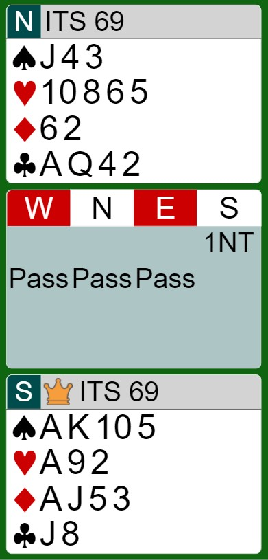

**Contoh 2** 
Cuma 6 HCP, tujuan bidding adalah part score, tidak ada kartu panjang (5+ lembar), pass merupakan bid yang terbaik. 

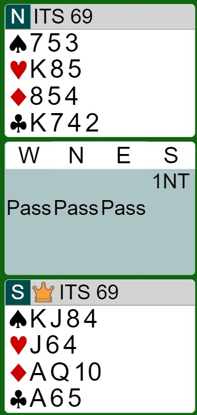

**Contoh 3** 
Cuma 6 HCP, tujuan bidding adalah part score, ada kartu panjang yaitu H dan S.  
Untuk mencari fit H harus lewat 2C yang dimana HCP-nya kurang. 
Untuk mencari fit C harus bid transfer 2S tapi kurang lembar karena minimal 6 lembar. 
Sehingga bid terbaik Pass. 

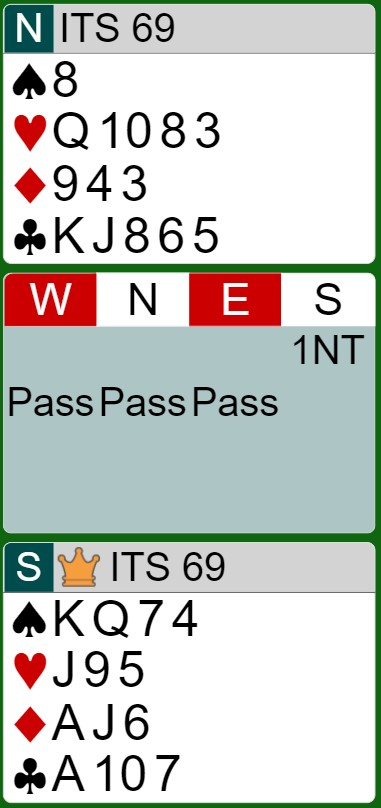

**Contoh 4** 
Cuma 5 HCP, gabisa nyari fit, pass saja.  

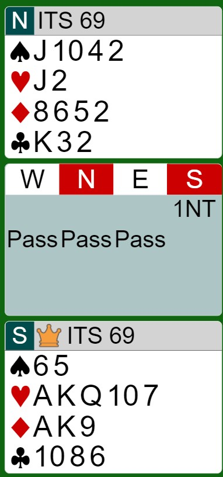

## Part Score: 1NT-2D/2H
[Back](#table-of-contents) 
Untuk part score di Major, hanya perlu lakukan transfer lalu pass. 

**Contoh 1** 
7 HCP, kalau invite bisa di gas game opener 7 + (16-17) = (23-24) HCP. sehingga part score-an saja lebih aman. 
Jika ingin 1NT-P juga tidak apa-apa karena HCP jika dijumlahkan minimum opener lebih dari 20 HCP. 

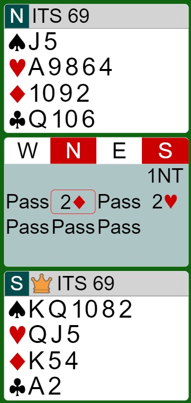

**Contoh 2** 
Ada singleton, lebih disarankan main part score 2 Major. 

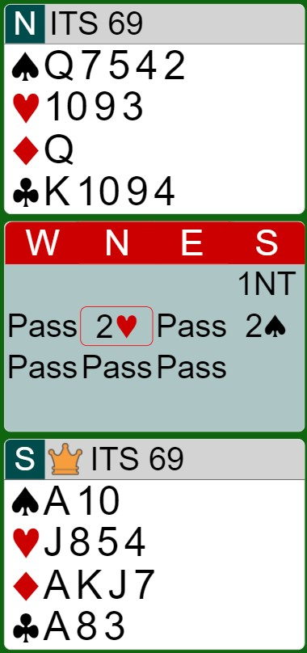

## Invite
[Back](#table-of-contents) 
HCP Invite = 8  
7 HCP jika distribusi bagus (siap bermain game 23 HCP)  
Jika HCP Opener :
- Minimum / 15 : Tidak game
- Maximum / 16-17 : Game

## Invite: 1NT-2C
[Back](#table-of-contents) 
**Contoh 1** 
HCP 7 cukup untuk melakukan stayman, serta siap dengan segala bid yang mungkin di bid oleh opener. 
Jika :
- 2D => di pass main 2D
- 2H => di pass main 2H gpp fit 7 lembar ada singleton membantu
- 2S => karena ada singleton dan fit Spade, bisa invite
- 2NT => HCP opener minimum, gak game, bid 3H transfer to 3S
- 3C => HCP opener maximum, gas game, bid 4H transfer to 4S

Note : singleton saat bermain kontrak suit sangat membantu karena seperti punya king atau second round control. 

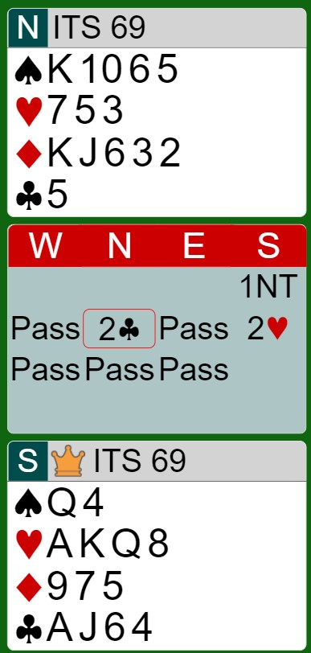

**Contoh 2** 
HCP 8 dan ingin invite to 3NT, maka biddingnya lewat 2C stayman. 

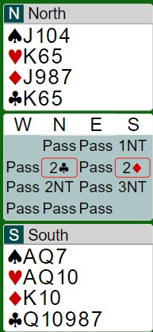

## Invite: 1NT-2D/2H
[Back](#table-of-contents) 

**Contoh 1** 
HCP Utara 8, 5 Lembar S, ingin invite dengan menunjukkan 5S-nya. 
Berikut arti-arti biddingnya :  
- 1NT = 15-17 HCP Balance
- 2H = Transfer to S (5+S)
- 2S = Accept transfer (2+S)
- 2NT = 5S invite to 3NT or 4S
Tambahan :  
- 3S = 6+S invite to 4S

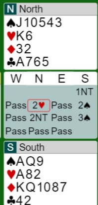

**Contoh 2-3** 
HCP Utara 8, **6 Lembar S**, ingin invite dengan menunjukkan 6S-nya. 
Setelah transfer bid 3S = invite to 4S. 

(Opener 15 HCP) 

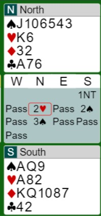

(Opener 17 HCP) 
Untuk 16 HCP biasanya dianggap maximum dan digas game. 

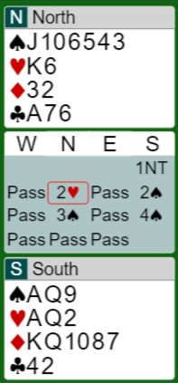

## Game
[Back](#table-of-contents) 
HCP minimal 9 untuk tujuan bidding pasti game.  

## Game: 1NT-2C
[Back](#table-of-contents) 
Tujuannya mencari fit Major, jika ketemu bid 4M game, jika tidak bid 3NT. Jika dijawab 44M, dilanjut dengan bid transfer 4D/4H.  

**Contoh 1** 
HCP 11, pasti game, terdapat 4H dan 4S, bisa cari fit Major dengan bid 2C.  
Jika :
- 2D => bid 3NT = T/P
- 2H => bid 4H = T/P
- 2S => bid 4S = T/P
- 2NT/3C => bid 4D/4H = Transfer to 4H/4S

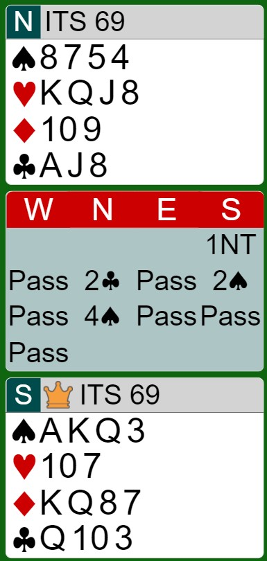

**Contoh 2** 
HCP 9, pasti game, terdapat 4 lembar H, bisa cari fit Heart dengan bid 2C.  
Jika :
- 2D => bid 3NT = T/P
- 2H => bid 4H = T/P
- 2S => bid 3NT = T/P
- 2NT/3C => bid 4D = Transfer to 4H

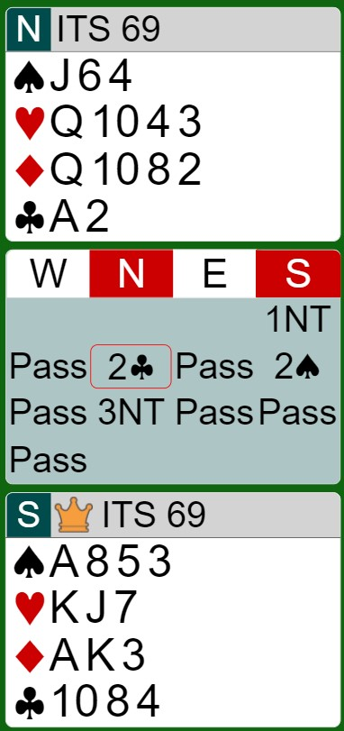

**Contoh 3** 
HCP 12, pasti game, terdapat 4 lembar Spade, bisa cari fit Spade dengan bid 2C.  
Jika :
- 2D => bid 3NT = T/P
- 2H => bid 3NT = T/P
- 2S => bid 4S = T/P
- 2NT/3C => bid 4H = Transfer to 4S

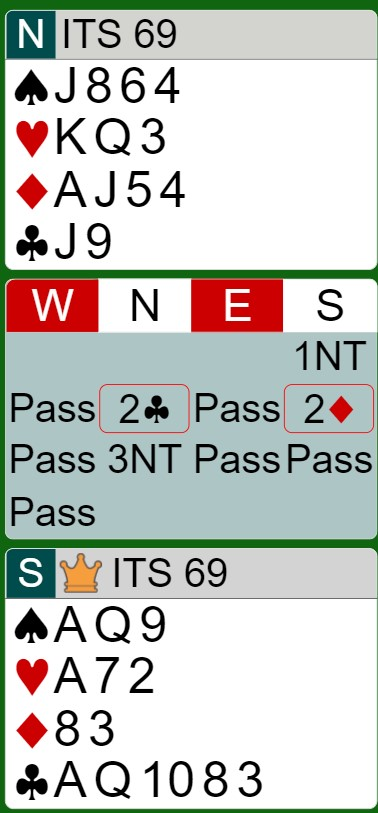

**Contoh 4** 

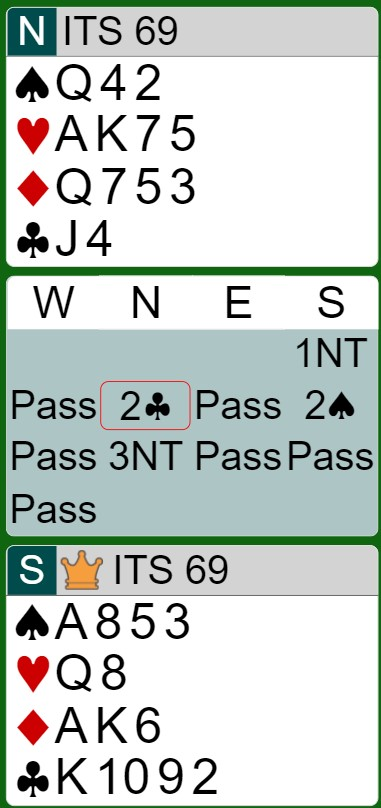

## Slam Interest
[Back](#table-of-contents) 
Slam interest kartunya ada kemungkinan slam, jadi bisa coba bidding untuk mencari slam.  

## Slam Interest: 1NT-2S

[Back](#table-of-contents) 
**Contoh 1** 

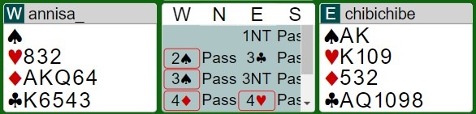

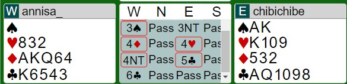

 
Dengan tangan barat, barat harusnya kepikiran untuk bermain slam dengan poin yang concentrate pada Diamond Club sehingga setelah bid 2S,
jawaban apapun akan dilanjutkan dengan splinter S (bid 3S). 
setelah itu, walaupun opener nutup 3NT, barat akan tetap melanjutkannya dengan set fit / langsugn cue. 

- 4C = Set fit Club (bidding paling aman)
- 4D = Cue D (Harus partnership kuat)
- 4H = Cue H (No Cue D)

Setelah itu opener tidak boleh nutup bid 5C (kecuali tidak ada cue H & splinter yang ketemu HCP besar). 
opener paling aman tanya keycard dengan bid 4S/4NT (Sesuai janjiannya) jika tidak ada cue H. 

Setelah mendapatkan cue H. barat tentunya ingin menanyakan keycard selain keycard Spade (Exclusion). untuk melakukan ini ada 2 cara yang sesuaji janjiannya, yaitu : 
- Jika janjian 4S = tanya keycard fit C, maka 4NT = Exclusion S
- Jika janjian 4NT= tanya keycard fit C, maka 4S = Void S
    - Jika melakukan cue di 4S, maka opener tinggal bertanya keycard.
    - Perlu diperhatikan keycard west tidak mungkin 0 sehingga tidak mungkin overbid

Setelah keycard totalnya 3 selain Spade, maka tutup 6C. 

## Slam Interest: 1NT-4NT
[Back](#table-of-contents) 
**Contoh 1** 
HCP 12, agak nyuri poin sebenarnya, tapi karena ada running suit Diamond 6 lembar jadi memungkinkan untuk mencari slam. 
Akan tetapi, karena HCP opener minimum (15-16 HCP) jadinya dipass. 
Quantitative ketemu minimum => tidak slam  
Quantitative ketemu maximum => mungkin slam  

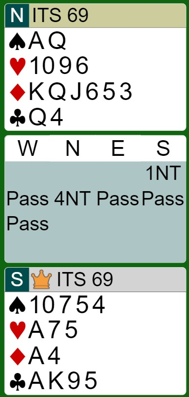

