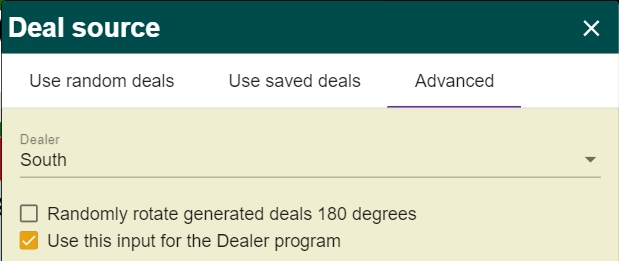

# BBO Script

Pengaturan ini bisa digunakan untuk practice & bidding table
<br>
Setelah masuk table :
1. Klik garis 3 di kiri atas
2. Klik "Deal Source" atau ketiga dari bawah
3. Klik "Advanced" atau yang paling kanan
4. Wajib centang pilihan kedua
5. Pilih Dealer
6. Jika ingin gantian yang dapet kartu settingan, centang pilihan pertama
7. Copy salah satu script, misal "Open_1C.txt"
8. Paste di BBO-nya
9. Redeal

## Catatan
- Kartu yang diatur lewat script agar melakukan opening adalah South
- East & West diatur agar tidak bisa melakukan bidding
- Bisa saja partner mendapatkan kartu opening lain, sehingga jika ingin selalu opening,
	jangan centang pilihan pertama (rotate 180 degree) dan dealer selalu south


- Kartu musuh diatur supaya tidak bisa overcall, jika ingin bisa overcall, hapus bagian ini :
```
//Supaya kemungkinan musuh melakukan bid sangat kecil
balancedOpps = shape(east, any 4432 + any 4333) && shape(west, any 4432 + 4333)
balancedHCP = -1 <= (hcp(east) - hcp(west)) && (hcp(east) - hcp(west)) <= 1
conditionEW = balancedOpps && balancedHCP
```
Potongan script tersebut akan memberikan distribusi musuh yang balance tanpa 5 lembar dan hcp yang rata, sehingga tidak bisa melakukan overcall

- Jika ingin selalu Game / better / worse, edit bagian ini :
```
//Jika ingin kartunya mengarah game terus, 
//atur ini ke ">= 24 atau 25"
totalHCP = (hcp(south) + hcp(north)) >= 21
```
- Jika ingin dibuatkan script, menemukan error, dll, dapat menghubungi saya lewat email : aminemc236@gmail.com

## Cara menulis Script sendiri
Berikut beberapa command / syntax agar bisa menulis sendiri

### Logic / Syntax
Logic pada BBO script ada beberapa yaitu :
```
1   : True
0   : False
&&  : dan
||  : atau
!   : negasi
>   : lebih dari
>=  : lebih dari sama dengan
<   : kurang dari
<=  : kurang dari sama dengan
==  : sama dengan
!=  : tidak sama dengan
()  : tanda kurung
//  : Comment
```

### Variable
Kita bisa menyimpan kondisi dalam variabel untuk mempermudah pembuatan script, semisal seperti dibawah ini
```
nama_variabel = 1
```
Pada contoh di atas, kita set nilai dari nama_variabel True
<br>
Nama variabel yang tidak diperbolehkan adalah diawali dengan angka, mengandung spesial karakter selain "_"
```
123_adf
nama variabel
hcpw_12++
```

### Player
Player ditulis dengan "north", "west", "south", "east"
<br>
Contoh pemakaian akan ditunjukkan pada command command selanjutnya

### HCP
Kita bisa mengecek HCP salah satu player, dengan cara "hcp(player)", berikut contohnya
```
//Cek apakah west hcp nya > 12
HCPW12Plus = hcp(west) >= 12
//Cek apakah hcp north terdapat pada rentang [15,17]
HCPN_15_17 = 15 <= hcp(north) && hcp(north) <= 17
```
diakhir untuk membuat distribusi yang diberikan oleh BBO mengeluarkan logic yang kita telah simpan pada variabel jalankan perintah pada bagian berikutnya yaitu "condition"

### Condition
Command "condition" digunakan untuk mengecek kartu yang telah digenerate apakah sesuai dengan logic yang diberikan, jika tidak akan di-skip, jika memenuhi akan diberikan kepada pemain
```
condition HCPW12Plus && HCPN_15_17
```
taruh command tersebut di akhir script
condition hanya boleh sekali, jika lebih dari sekali, hanya menerapkan condition yang terakhir kali dipanggil

### Lembaran Trump
Kita bisa mengecek lembaran masing masing suit yaitu dengan command ["namaSuit"+"s({player})"] atau langsung saja lihat contohnya
```
spades(north) > 5
hearts(west) == 4
clubs(east) < 2
diamonds(south) > 6
```

### Shape
Shape merupakan salah satu tool terkuat yang dimiliki BBO untuk mengeluarkan distribusi, berikut beberapa beserta penjelasan
#### simple shape
shape di bawah akan mengecek tangan north, apakah distribusinya 5431 dengan 5 Spades, 4 Hearts, 3 Diamonds, 1 Clubs
```
shape(north, 5431)
```

#### any shape
shape di bawah akan mengecek tangan east apakah 5332, akan tetapi bisa teracak tidak harus sesuai urutan spade, heart, diamond, club
```
shape(east, any 5332)
```

#### x shape
shape di bawah akan mengecek apakah south memegang 55 minor tanpa mempedulikan distribusi di suit lainnya
```
shape(south, xx55)
```

#### + shape
shape di bawah akan mengecek tangan west apakah 4333 atau 4432 atau 5332 tidak harus seusai urutan SHDC karena ada "any"
```
shape(west, any 4333 + any 4432 + any 5332)
```
shape di atas sering digunakan untuk mendapatkan distribusi balance

#### - shape
shape di bawah akan mengecek apakah tangan south balance, tetapi tidak mempunyai 5 lembar Major
```
shape(south, any 4333 + any 4432 + any 5332 - 5xxx - x5xx)
```
"- 5xxx" membuat distribusi tidak boleh mempunyai 5 lembar spade dengan tidak mempedulikan suit lainnya, jika digabungkan dengan "+ any 5332", maka kita tidak akan mendapatkan 5332 dengan spade 5 lembar
<br>
begitu juga dengan heart "- x5xx"

### Contoh Script
Berikut contoh script untuk opening 1C presisi yaitu "16-17 HCP Unbalance / 18+ any dist"
```
//----- Open 1C -----//
//1C = 16-17 Unbalance or 18+ any
//Balance : 4333, 4432, 5332

//deklarasi variable yang bisa dihapus
conditionEW = 1
northDist = 1
totalHCP = 1
balancedOpps = 1
balancedHCP = 1
//---done---//

//Rentang HCP South
southHCP = hcp(south) >= 16
southHCP_16_17 = 16 <= hcp(south) && hcp(south) <= 17

//Distribusi South
southBal = shape(south, any 4432 + any 4333 + any 5332)
southDist = (southHCP || (southHCP_16_17 && !southBal))

//Jika ingin kartunya mengarah game terus, 
//atur ini ke ">= 24 atau 25"
totalHCP = (hcp(south) + hcp(north)) >= 21

//Distribusi North, sementara set true saja
northDist = 1

//Supaya kemungkinan musuh melakukan bid sangat kecil
balancedOpps = shape(east, any 4432 + any 4333) && shape(west, any 4432 + 4333)
balancedHCP = -1 <= (hcp(east) - hcp(west)) && (hcp(east) - hcp(west)) <= 1
conditionEW = balancedOpps && balancedHCP

//Kondisi South - North
conditionSN = southHCP && southDist && totalHCP && northDist

condition conditionEW && conditionSN

//----- ..... -----//
```

